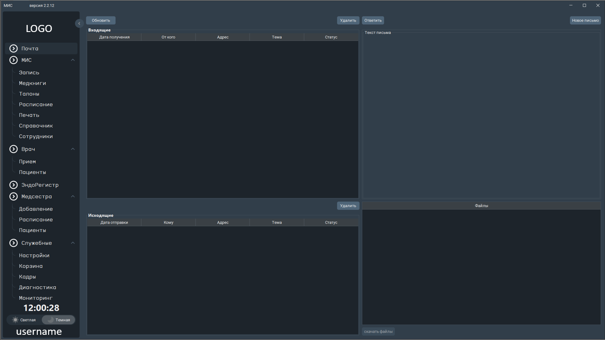

# Медицинская Информационная Система (МИС)

 

## Описание

**МИС** — это современная медицинская информационная система для автоматизации работы медицинских организаций. Программа реализована на Java с использованием FlatLaf для стильного и удобного интерфейса. Система позволяет вести учёт пациентов, управлять расписанием, формировать отчёты, печатать документы, работать с электронной почтой и многое другое.

---

## Основные возможности

- Ведение базы пациентов
- Расписание приёмов и сотрудников
- Работа с медицинскими книжками
- Учёт талонов и запись на приём
- Печать документов и отчётов
- Электронная почта внутри системы
- Поиск и фильтрация данных
- Многоуровневая система доступа
- Уведомления и напоминания
- Современный внешний вид (FlatLaf)

---

## Скриншоты
> 

---

## Установка

1. Убедитесь, что у вас установлен **Java 8** или выше.
2. Клонируйте или скачайте данный репозиторий.
3. Откройте проект в вашей IDE (например, NetBeans или IntelliJ IDEA).
4. Убедитесь, что все библиотеки из папки `lib/` подключены к проекту:
    - flatlaf-3.2.jar
    - flatlaf-extras-3.2.jar
    - flatlaf-fonts-roboto-2.137.jar
    - jsvg-1.2.0.jar
    - swing-toast-notifications-1.0.1.jar

---

## Запуск

- Соберите проект через IDE или с помощью Ant/Gradle.
- Запустите главный класс:
    - `tools.application.Application` или используйте собранный JAR-файл `dist/MIS2.jar`.
- При необходимости настройте параметры подключения к базе данных в исходном коде.

---

## Структура проекта

```
flatlaf-dashboard-main/
├── build/                # Сборочные файлы
├── lib/                  # Сторонние библиотеки (JAR)
├── nbproject/            # Конфигурация NetBeans
├── src/                  # Исходный код
│   ├── forms/            # Формы интерфейса
│   ├── patient/          # Работа с пациентами
│   ├── tools/application # Основные классы приложения
│   ├── tools/menu/       # Меню и навигация
│   └── ...
└── README.md             # Описание проекта
```

---

## Используемые библиотеки

- [FlatLaf](https://github.com/JFormDesigner/FlatLaf) — современный внешний вид для Swing
- [jsvg](https://github.com/jfree/jsvg) — работа с SVG-графикой
- [Swing Toast Notifications](https://github.com/karimsinouh/swing-toast-notifications) — всплывающие уведомления

---

## Контакты

Автор: **Tony Shipel**
